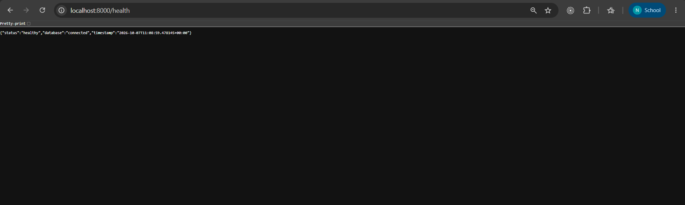
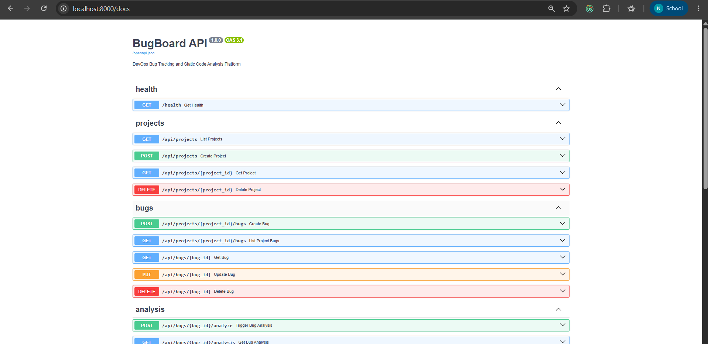
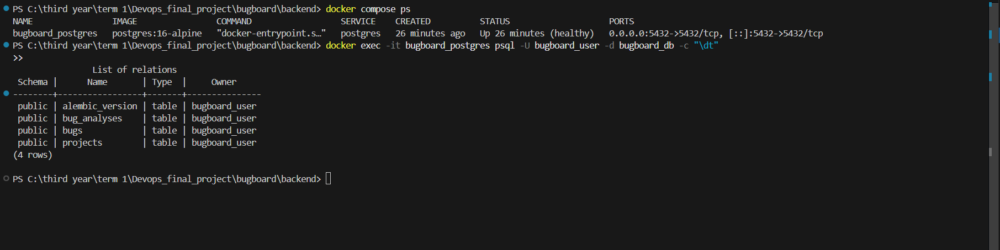
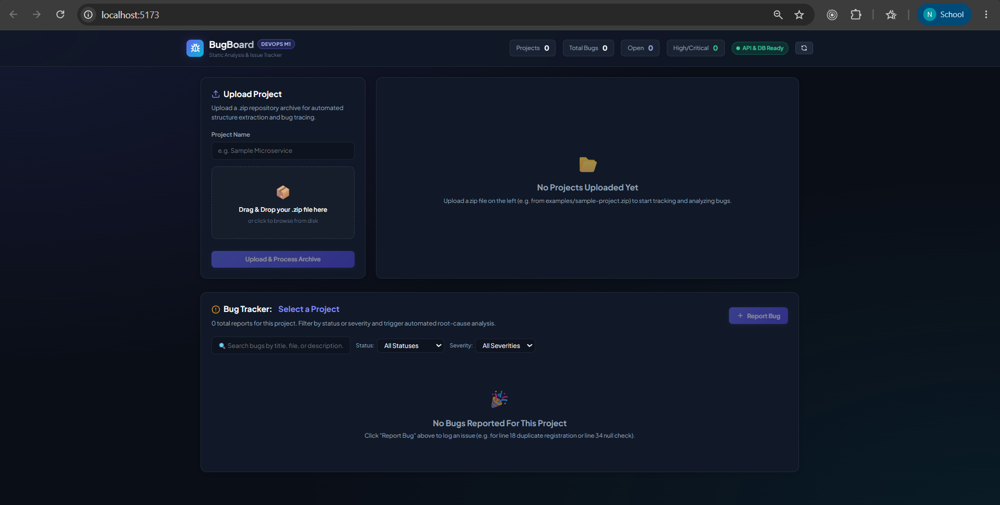
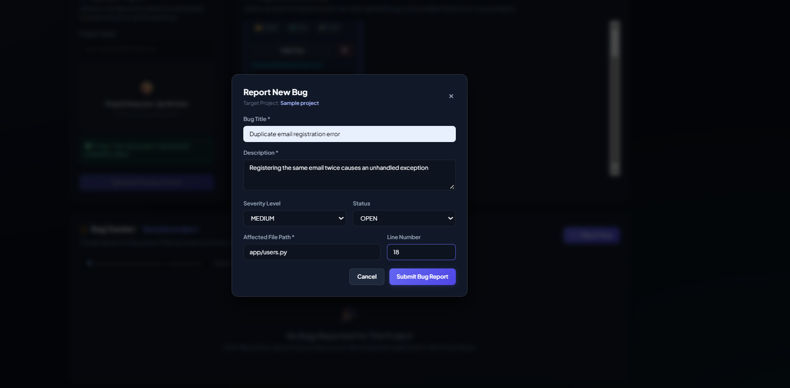
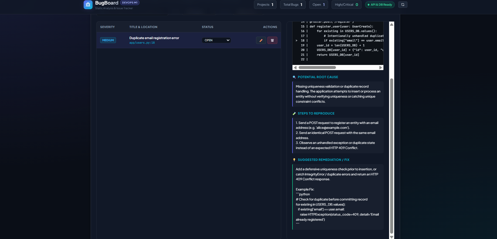

# Module 1 (M1) — Application: Frontend + Backend + Database

**Status:** Completed (10 / 10 Points)  
**Project:** BugBoard — DevOps Bug Tracking & Static Code Analysis Platform  
**Repository:** [FullStack_Devops](https://github.com/Nandani2024-tech/FullStack_Devops)  

---

## 1. Executive Summary

Module 1 serves as the complete foundational full-stack containerized application for the DevOps Capstone. It implements:
- **FastAPI Backend:** High-performance RESTful API with automated static code analysis, Prometheus instrumentation, and health probes.
- **PostgreSQL Database:** Managed with SQLAlchemy ORM and Alembic database versioning migrations.
- **React + Vite Frontend:** Modern, responsive dark-themed dashboard with live statistics, project upload, bug reporting, and interactive code analysis.
- **Docker Compose Stack:** Multi-service orchestration running Postgres 16 Alpine, FastAPI backend, and Vite frontend with persistent volumes and health checks.

---

## 2. Grading Criteria & Completion Matrix

| Criterion | Points | Status | Implementation Details |
| :--- | :---: | :---: | :--- |
| **FastAPI backend starts and responds to `/health`** | 2 / 2 | Complete | Returns `200 OK` with JSON payload confirming application and database connectivity. |
| **Minimum 4 REST API endpoints implemented (GET, POST, PUT, DELETE)** | 3 / 3 | Complete | Over 10 REST endpoints implemented covering all CRUD operations. |
| **PostgreSQL database managed by Alembic migrations** | 2 / 2 | Complete | PostgreSQL schema with `projects`, `bugs`, and `bug_analyses` tables managed via `0001_initial_schema.py`. |
| **React frontend renders and makes live API calls** | 2 / 2 | Complete | React 18 SPA built with Vite making live HTTP calls to `/health`, `/api/projects`, `/api/bugs`. |
| **Responsive and usable UI (not a blank page)** | 1 / 1 | Complete | Rich glassmorphic dark interface with cards, badges, modal dialogs, and code viewer. |
| **Total** | **10 / 10** | **Complete** | **All M1 Requirements Fully Verified** |

---

## 3. Detailed Verification & Implementation Evidence

### 3.1. Health & Database Connectivity (`GET /health`)
- **Endpoint:** `GET http://localhost:8000/health`
- **Controller:** `backend/app/routes/health.py`
- **Output:**
  ```json
  {
    "status": "healthy",
    "database": "connected",
    "timestamp": "2026-10-07T10:02:54.893470+00:00"
  }
  ```

> #### 📸 Health Check
>

---

### 3.2. REST API Endpoints (CRUD Coverage)

The backend implements full RESTful lifecycle management across projects and bugs:

| Method | Endpoint | Description | Status |
| :--- | :--- | :--- | :---: |
| `GET` | `/health` | Application status & DB probe | Complete |
| `POST` | `/api/projects` | Multipart upload of `.zip` project | Complete |
| `GET` | `/api/projects` | List all uploaded projects | Complete |
| `GET` | `/api/projects/{id}` | Detailed project view with file tree hierarchy | Complete |
| `DELETE`| `/api/projects/{id}` | Deletes project, associated bugs, and filesystem files | Complete |
| `POST` | `/api/projects/{id}/bugs` | Create a new bug report | Complete |
| `GET` | `/api/projects/{id}/bugs` | List bugs filterable by status & severity | Complete |
| `GET` | `/api/bugs/{id}` | Retrieve specific bug details | Complete |
| `PUT` | `/api/bugs/{id}` | Update bug status, severity, title, or description | Complete |
| `DELETE`| `/api/bugs/{id}` | Delete a bug report | Complete |
| `POST` | `/api/bugs/{id}/analyze` | Trigger deterministic static code analysis | Complete |
| `GET` | `/api/bugs/{id}/analysis` | Retrieve saved code analysis diagnostics | Complete |

> #### 📸 Interactive Swagger API Docs (`/docs`)
>

---

### 3.3. Database Schema & Alembic Migrations

- **Database Engine:** PostgreSQL 16 Alpine
- **Migration Tool:** Alembic (`alembic/versions/0001_initial_schema.py`)
- **Tables Verified:**
  1. `projects`: Primary metadata, file counts, python file count, test file count, extraction paths.
  2. `bugs`: Issue tracking with PostgreSQL enums `severity_level` (`LOW`, `MEDIUM`, `HIGH`, `CRITICAL`) and `bug_status` (`OPEN`, `IN_PROGRESS`, `RESOLVED`, `CLOSED`), cascading delete from projects.
  3. `bug_analyses`: One-to-one relationship with `bugs`, storing snippets, root causes, reproduction steps, and suggested fixes.
  4. `alembic_version`: Version tracking table.

```sql
                List of relations
 Schema |      Name       | Type  |     Owner     
--------+-----------------+-------+---------------
 public | alembic_version | table | bugboard_user
 public | bug_analyses    | table | bugboard_user
 public | bugs            | table | bugboard_user
 public | projects        | table | bugboard_user
(4 rows)
```

> #### 📸 Database Tables in Postgres / Terminal


---

### 3.4. React Frontend (Vite) UI & Live API Integration

The frontend delivers an intuitive, responsive user experience:
1. **Navbar:** Real-time stats bar calculating Total Projects, Total Bugs, Open Bugs, High/Critical Bugs, and dynamic backend health status pill.
2. **Project Upload Box:** Drag-and-drop or file selector accepting `.zip` archives.
3. **Projects Browser:** Displays project cards, extracted file stats, directory tree viewer, and delete actions.
4. **Bug Tracker:** Filterable by status (`OPEN`, `IN_PROGRESS`, `RESOLVED`, `CLOSED`) and severity (`LOW`, `MEDIUM`, `HIGH`, `CRITICAL`), plus keyword search.
5. **Bug Report Modal:** Input form for title, description, severity, affected file, and line number.
6. **Code Analysis Panel:** Triggers deterministic code analysis, displaying the exact source snippet with line highlighting, root cause diagnosis, reproduction steps, and suggested fix.

> #### 📸 Running Frontend Dashboard
> 

> #### 📸 Bug Report Modal
>


> #### 📸  Automated Code Analysis Panel
> 

---


## 4. Submission Artifacts Checklist

- [x] `backend/app/` — Python models, schemas, database config, analyzer, and API routes.
- [x] `backend/alembic/versions/` — Initial schema migration (`0001_initial_schema.py`).
- [x] `backend/requirements.txt` — Python dependencies pinned.
- [x] `frontend/` — React + Vite source files, CSS design system, and components.
- [x] `docker-compose.yml` — Working multi-container stack definition with volumes.
- [x] `examples/sample-project.zip` — Packaged test project with intentional bugs for live demonstration.
- [x] Screenshots embedded in the placeholders above.
