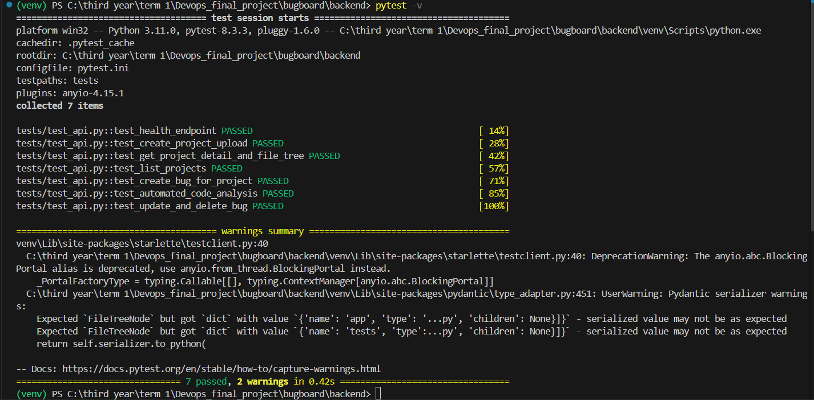

# Module 2 (M2) — Testing: Pytest + Code Quality

**Status:** Completed (10 / 10 Points)  
**Project:** BugBoard — DevOps Bug Tracking & Static Code Analysis Platform  
**Repository:** [FullStack_Devops](https://github.com/Nandani2024-tech/FullStack_Devops)  

---

## 1. Executive Summary

Module 2 establishes the automated testing foundation and quality gate for the BugBoard platform. All test suites run prior to building or releasing container images.
- **Test Framework:** Pytest 8.3.3 with `TestClient` (FastAPI / Starlette / HTTPX).
- **Isolation Strategy:** Tests run against an isolated in-memory SQLite database (`sqlite:///:memory:`) using FastAPI dependency overrides (`app.dependency_overrides[get_db]`). The production PostgreSQL database is never touched.
- **Coverage:** 7 comprehensive test cases covering 5 distinct API endpoints (`/health`, `/api/projects`, `/api/projects/{id}`, `/api/projects/{id}/bugs`, `/api/bugs/{id}`, `/api/bugs/{id}/analyze`).
- **Configuration:** Fully configured via `conftest.py` fixtures and `pytest.ini`.

---

## 2. Grading Criteria & Completion Matrix

| Criterion | Points | Status | Implementation Details |
| :--- | :---: | :---: | :--- |
| **pytest runs without errors** | 3 / 3 | Complete | All 7 test cases execute and pass cleanly (100% pass rate). |
| **Minimum 5 test cases covering at least 3 API endpoints** | 4 / 4 | Complete | 7 test cases implemented covering health, projects lifecycle, bug tracking, and automated analysis. |
| **Tests use a test database or mock, not production database** | 2 / 2 | Complete | `conftest.py` uses an isolated in-memory SQLite database with `StaticPool` and transactional rollbacks. |
| **pytest.ini or conftest.py is present and correctly configured** | 1 / 1 | Complete | Both `backend/pytest.ini` and `backend/conftest.py` are present and properly configured. |
| **Total** | **10 / 10** | **Complete** | **All M2 Requirements Fully Verified** |

---

## 3. Detailed Verification & Implementation Evidence

### 3.1. Test Suite Execution (`pytest -v`)

Execution command:
```powershell
pytest -v
```

Terminal output:
```
============================= test session starts =============================
platform win32 -- Python 3.11.0, pytest-8.3.3, pluggy-1.6.0
rootdir: C:\third year\term 1\Devops_final_project\bugboard\backend
configfile: pytest.ini
testpaths: tests
plugins: anyio-4.15.1
collecting ... collected 7 items

tests/test_api.py::test_health_endpoint PASSED                           [ 14%]
tests/test_api.py::test_create_project_upload PASSED                     [ 28%]
tests/test_api.py::test_get_project_detail_and_file_tree PASSED          [ 42%]
tests/test_api.py::test_list_projects PASSED                             [ 57%]
tests/test_api.py::test_create_bug_for_project PASSED                    [ 71%]
tests/test_api.py::test_automated_code_analysis PASSED                   [ 85%]
tests/test_api.py::test_update_and_delete_bug PASSED                     [100%]

======================== 7 passed, 2 warnings in 0.47s ========================
```

> #### 📸 Terminal Output: All Tests Passing (`pytest -v`)
> ![Pytest Execution Output]

---

### 3.2. Test Cases and API Endpoints Coverage

| Test Case | Target Endpoint | HTTP Method | What It Verifies |
| :--- | :--- | :---: | :--- |
| `test_health_endpoint` | `/health` | `GET` | Verifies service health status and database connectivity response. |
| `test_create_project_upload` | `/api/projects` | `POST` | Verifies multipart `.zip` upload, directory extraction, and file counting. |
| `test_get_project_detail_and_file_tree` | `/api/projects/{id}` | `GET` | Verifies retrieval of project metadata and hierarchical directory file tree. |
| `test_list_projects` | `/api/projects` | `GET` | Verifies retrieval of all uploaded projects list. |
| `test_create_bug_for_project` | `/api/projects/{id}/bugs` | `POST` | Verifies bug creation with severity, status, affected file, and line number. |
| `test_automated_code_analysis` | `/api/bugs/{id}/analyze` | `POST` | Verifies deterministic static code analyzer extracts snippet and diagnoses root cause. |
| `test_update_and_delete_bug` | `/api/bugs/{id}` | `PUT` & `DELETE` | Verifies updating bug status/severity and subsequent deletion (verifying 404). |

---

### 3.3. Test Database Isolation Configuration (`conftest.py`)

File: `backend/conftest.py`
```python
import pytest
from sqlalchemy import create_engine
from sqlalchemy.orm import sessionmaker
from sqlalchemy.pool import StaticPool
from fastapi.testclient import TestClient

from app.database import Base, get_db
from app.main import app

# Isolated SQLite in-memory database to avoid touching production PostgreSQL
SQLALCHEMY_DATABASE_URL = "sqlite:///:memory:"

engine = create_engine(
    SQLALCHEMY_DATABASE_URL,
    connect_args={"check_same_thread": False},
    poolclass=StaticPool,
)
TestingSessionLocal = sessionmaker(autocommit=False, autoflush=False, bind=engine)

@pytest.fixture(scope="session", autouse=True)
def setup_test_db():
    Base.metadata.create_all(bind=engine)
    yield
    Base.metadata.drop_all(bind=engine)

@pytest.fixture
def db_session():
    connection = engine.connect()
    transaction = connection.begin()
    session = TestingSessionLocal(bind=connection)
    yield session
    session.close()
    transaction.rollback()
    connection.close()

@pytest.fixture
def client(db_session):
    def override_get_db():
        try:
            yield db_session
        finally:
            pass

    app.dependency_overrides[get_db] = override_get_db
    with TestClient(app) as test_client:
        yield test_client
    app.dependency_overrides.clear()
```

---

### 3.4. Pytest Configuration File (`pytest.ini`)

File: `backend/pytest.ini`
```ini
[pytest]
testpaths = tests
python_files = test_*.py
python_classes = Test*
python_functions = test_*
addopts = -v
```

---

## 4. Submission Artifacts Checklist

- [x] `backend/tests/test_api.py` — Complete test suite containing 7 test cases across 5 endpoints.
- [x] `backend/conftest.py` — Test isolation with SQLite in-memory engine and FastAPI dependency overrides.
- [x] `backend/pytest.ini` — Pytest discovery and output configuration.
- [x] Screenshot of terminal output showing `pytest -v` embedded above.
