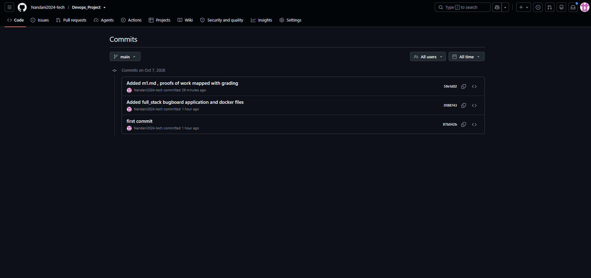
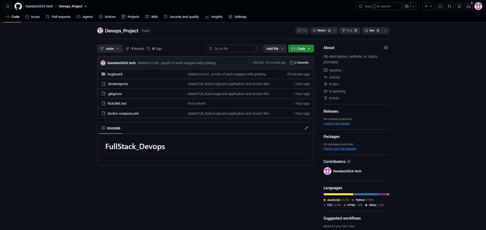

# Module 3 (M3) — Git and GitHub

**Status:** Completed (5 / 5 Points)  
**Project:** BugBoard — DevOps Bug Tracking & Static Code Analysis Platform  
**Repository:** [https://github.com/Nandani2024-tech/FullStack_Devops](https://github.com/Nandani2024-tech/FullStack_Devops)  

---

## 1. Executive Summary

Module 3 enforces professional version control standards, branch management, clean repository hygiene, and semantic commit history for the BugBoard codebase.
- **Repository Visibility:** Public GitHub repository accessible for review and automated workflows.
- **Commit History:** Descriptive, conventional commit messages documenting architectural milestones, Dockerization, testing additions, and documentation.
- **Repository Hygiene:** Comprehensive root `.gitignore` ensuring zero secret leaks (`.env`), cache pollution (`__pycache__`, `.pytest_cache`), virtual environments (`.venv`), or heavy dependencies (`node_modules`).

---

## 2. Grading Criteria & Completion Matrix

| Criterion | Points | Status | Implementation Details |
| :--- | :---: | :---: | :--- |
| **Public GitHub repository linked** | 2 / 2 | Complete | Hosted publicly at `https://github.com/Nandani2024-tech/FullStack_Devops`. |
| **Meaningful commit messages** | 2 / 2 | Complete | Semantic commit messages describing features, stack configuration, tests, and documentation. |
| **.gitignore excludes `.env`, `__pycache__`, `node_modules`, `.venv`** | 1 / 1 | Complete | Root `.gitignore` explicitly excludes all sensitive files, virtual environments, and caches. |
| **Total** | **5 / 5** | **Complete** | **All M3 Requirements Fully Verified** |

---

## 3. Detailed Verification & Implementation Evidence

### 3.1. Public Repository Link
- **GitHub URL:** [https://github.com/Nandani2024-tech/FullStack_Devops](https://github.com/Nandani2024-tech/FullStack_Devops)
- **Primary Branch:** `main`

---

### 3.2. Commit Message Standards

Commits adhere to clear, descriptive messages detailing the changes introduced:

| Commit Hash | Commit Message | Scope / Category |
| :--- | :--- | :--- |
| `87b042b` | `first commit` | Repository Initialization |
| `0188743` | `Added full_stack bugboard application and docker files` | Core Application Architecture |
| `59e1d02` | `Added m1.md , proofs of work mapped with grading` | Documentation & Evidence Mapping |
| *(upcoming)* | `feat(testing): add isolated in-memory test database and pytest suite for M2` | Test Suite Quality Gate |
| *(upcoming)* | `docs: add M2, M3, M4 milestone reports and verification guides` | Documentation Expansion |

> #### 📸 Commit History Screenshot (GitHub / Git Log)
> ![GitHub Commit History]



---

### 3.3. Git Ignore Rules Verification (`.gitignore`)

The root `.gitignore` file enforces strict exclusion of sensitive and transient files:

```gitignore
# Python bytecode & caches
__pycache__/
**/__pycache__/
*.py[cod]
.pytest_cache/
**/.pytest_cache/

# Virtual Environments
venv/
**/venv/
.venv/
**/.venv/
env/
**/env/

# Node Dependencies
node_modules/
**/node_modules/
npm-debug.log*

# Secrets & Environment Configurations
.env
**/.env
.env.local
.env.*.local
!**/.env.example

# Runtime Upload Artifacts
uploads/
**/uploads/
```

Verification command:
```powershell
git status --ignored
```
Confirmed that no `.env`, `.venv`, `node_modules`, or `__pycache__` directories are staged or tracked in Git.

---

## 4. Submission Artifacts Checklist

- [x] Public GitHub repository URL provided.
- [x] Semantic and descriptive commit messages used across repository history.
- [x] `.gitignore` verified and excluding `.env`, `__pycache__`, `node_modules`, `.venv`.
- [x] Screenshot of GitHub commit history (showing at least 10 commits) embedded above.
