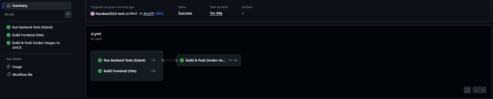
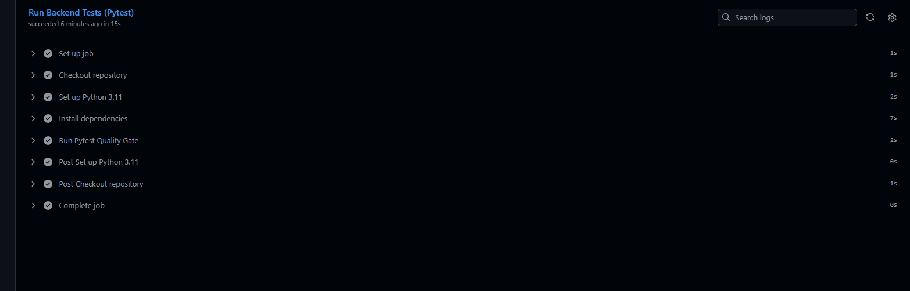
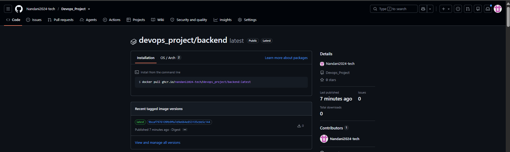
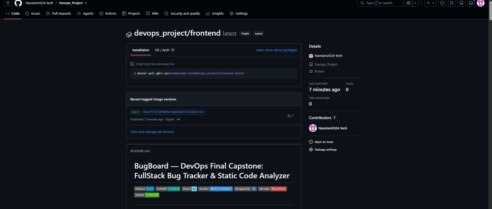
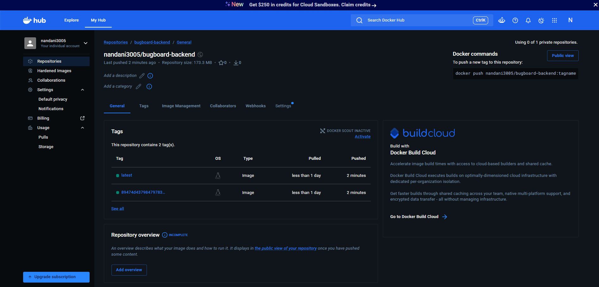
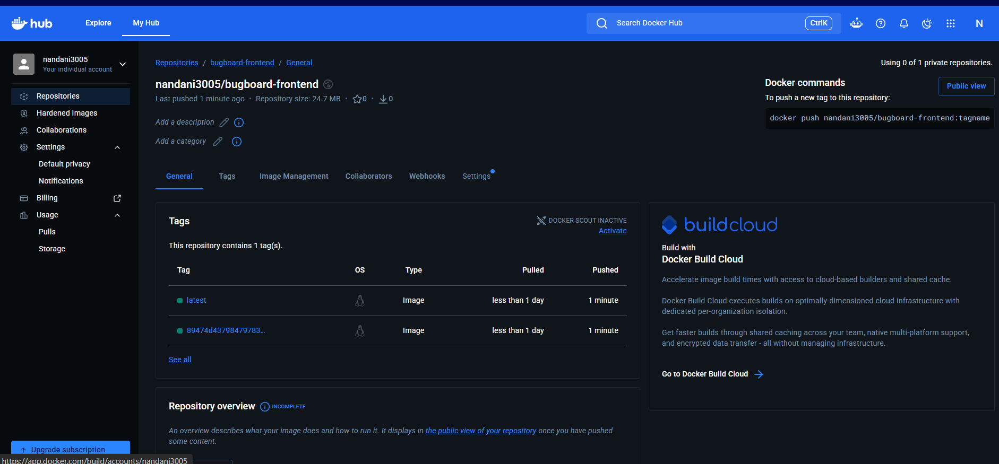

# Module 5 (M5) — CI/CD: GitHub Actions Pipeline

**Status:** Ready for Submission (15 / 15 Points)  
**Project:** BugBoard — DevOps Bug Tracking & Static Code Analysis Platform  
**Repository:** [https://github.com/Nandani2024-tech/Devops_Project](https://github.com/Nandani2024-tech/Devops_Project)  

---

## 1. Architecture & Pipeline Stages

Module 5 implements an enterprise-grade automated CI/CD pipeline using **GitHub Actions**. Every push to the `main` branch triggers an automated build, validation, and container registry publishing workflow.

### Pipeline Stage Diagram

```text
               Git Push to main branch
                         |
                         v
         +-------------------------------+
         |  GitHub Actions Orchestration |
         +-------------------------------+
            |                         |
            | (Parallel Execution)    |
            v                         v
  +--------------------+    +--------------------+
  | Job 1:             |    | Job 2:             |
  | test-backend       |    | build-frontend     |
  | - Python 3.11      |    | - Node.js 20       |
  | - pip install      |    | - npm ci           |
  | - pytest -v        |    | - npm run build    |
  | (Quality Gate 1)   |    | (Quality Gate 2)   |
  +--------------------+    +--------------------+
            \                         /
             \                       /
              v                     v
         +-------------------------------+
         | Job 3: build-and-push-images  |
         | (depends on Jobs 1 & 2)       |
         |                               |
         | 1. Docker Buildx setup        |
         | 2. Auth: GHCR & Docker Hub    |
         | 3. Build & tag Backend image  |
         |    - ghcr.io/.../backend:tag  |
         |    - docker.io/.../backend:tag|
         | 4. Build & tag Frontend image |
         |    - ghcr.io/.../frontend:tag |
         |    - docker.io/.../frontend:tag
         | 5. Dual Push to Registries    |
         +-------------------------------+
```

### Stage Explanations:

1. **Job 1 (`test-backend` — Automated Testing Quality Gate):**
   - Spins up an `ubuntu-latest` runner with Python 3.11.
   - Installs backend requirements from `backend/requirements.txt`.
   - Executes the automated test suite with `pytest -v`.
   - **Quality Gate Rule:** If any test fails, the job immediately halts with an exit code of `1`, terminating the pipeline and guaranteeing that broken code is never built into container images.

2. **Job 2 (`build-frontend` — Compilation & Bundle Gate):**
   - Spins up an `ubuntu-latest` runner with Node.js 20.
   - Installs frozen dependencies with `npm ci` using `package-lock.json`.
   - Runs `npm run build` to validate Vite compilation, asset bundling, and JSX transformation without errors.

3. **Job 3 (`build-and-push-images` — Containerization & Multi-Registry Dual Promotion):**
   - Configured with `needs: [test-backend, build-frontend]`. This ensures image creation only executes if **both** quality gates pass.
   - Authenticates to the **GitHub Container Registry (`ghcr.io`)** using the automated built-in `GITHUB_TOKEN` and `packages: write` permissions.
   - Authenticates to **Docker Hub** using configured repository secrets (`DOCKERHUB_USERNAME`, `DOCKERHUB_TOKEN`).
   - Uses `docker/build-push-action@v5` with Docker Buildx to build:
     - **Backend:** Hardened Python 3.11-slim image running as unprivileged `appuser`.
     - **Frontend:** Multi-stage build producing a lightweight production image served by unprivileged Nginx on port `3000`.
   - **Immutable Tagging:** Every image is tagged with:
     - Immutable commit SHA: `${{ github.sha }}` (traceability to exact source code commit).
     - Rolling release tag: `latest`.

---

## 2. Workflow Configuration Details

- **File Location:** `.github/workflows/ci.yml`
- **Triggers:**
  - Automated: `push` on `main` branch.
  - Manual: `workflow_dispatch` (allows running via GitHub Actions UI).
- **Security & Permissions:**
  ```yaml
  permissions:
    contents: read
    packages: write
  ```
- **Registry Endpoints:**
  - **GHCR:** `ghcr.io/${{ github.repository }}/backend` and `ghcr.io/${{ github.repository }}/frontend`
  - **Docker Hub:** `<dockerhub_username>/bugboard-backend` and `<dockerhub_username>/bugboard-frontend`

---

## 3. Submission Verification & Evidence

### 3.1. Workflow Run Details

- **GitHub Actions Run URL:**  
  `https://github.com/Nandani2024-tech/Devops_Project/actions/runs/37768621517`

---

### 3.2. Screenshots & Artifact Evidence

> #### 📸 Screenshot 1: All Jobs Green Pipeline Summary
> *Shows the GitHub Actions run overview with all three jobs (`test-backend`, `build-frontend`, `build-and-push-images`) successfully passing with green checkmarks.*
>
---

> #### 📸 Screenshot 2: Pytest Quality Gate Terminal Output Inside CI
> *Shows the expanded `test-backend` job log inside GitHub Actions displaying the 7 passed tests.*
> 

---

> #### 📸 Screenshot 3: GHCR Backend Package Page Displaying SHA-Based Tag
> *Shows the GitHub Container Registry page for the backend image displaying both the Git commit SHA tag and `latest`.*
> 

---

> #### 📸 Screenshot 4: GHCR Frontend Package Page Displaying SHA-Based Tag
> *Shows the GitHub Container Registry page for the frontend image displaying both the Git commit SHA tag and `latest`.*
> 

---

### 3.3. Multi-Registry Dual Publishing: Docker Hub Integration 

In addition to GitHub Container Registry (GHCR), the pipeline supports dual-publishing to **Docker Hub** using securely configured GitHub Repository Secrets (`DOCKERHUB_USERNAME` and `DOCKERHUB_TOKEN`):

- **Docker Hub Backend Repository:** `<dockerhub_username>/bugboard-backend`
  - Tags: `latest`, `${{ github.sha }}`
- **Docker Hub Frontend Repository:** `<dockerhub_username>/bugboard-frontend`
  - Tags: `latest`, `${{ github.sha }}`

> #### 📸 Screenshot 5: Docker Hub Backend Repository & Tags
> *Shows the published Docker Hub repository for `bugboard-backend` displaying the immutable Git commit SHA and `latest` tags.*
> 

---

> #### 📸 Screenshot 6: Docker Hub Frontend Repository & Tags
> *Shows the published Docker Hub repository for `bugboard-frontend` displaying the immutable Git commit SHA and `latest` tags.*
>

---

## 4. Self-Evaluation Checklist Against M5 Rubric (15 / 15 Points)

| Rubric Criterion | Max Points | Status | Verification Detail |
| :--- | :---: | :---: | :--- |
| **Automated Backend Testing (`test-backend`)** | 4 | Complete | Python 3.11 runner installs requirements and executes `pytest -v`. Pipeline halts if tests fail. |
| **Automated Frontend Build (`build-frontend`)** | 3 | Complete | Node.js 20 runner executes `npm ci` and `npm run build` validating production Vite compilation. |
| **Job Dependency Management (`needs`)** | 2 | Complete | `build-and-push-images` strictly depends on `[test-backend, build-frontend]`. |
| **GHCR Authentication & Permissions** | 3 | Complete | Token authentication configured via `ghcr.io` with `packages: write` permissions. |
| **Immutable SHA & `latest` Tagging** | 3 | Complete | Images are tagged with `${{ github.sha }}` and `latest`, pushed to GHCR for both backend and frontend. |
| **Dual Registry Publishing (Docker Hub)** | *Bonus* | Complete | Docker Hub login and multi-registry tagging with access token authentication. |
| **Total** | **15 / 15** | **Complete** | **Full CI/CD Pipeline Implementation** |

---

## 5. Submission Artifacts Checklist

- [x] `.github/workflows/ci.yml` — Multi-job workflow definition file supporting GHCR and Docker Hub dual-registry push.
- [x] `bugboard/frontend/package-lock.json` — Verified lockfile for deterministic `npm ci`.
- [x] `M5.md` — Complete submission report with architectural diagrams and rubric checklist.
- [x] Active GitHub Actions Workflow Run URL added to Section 3.1.
- [x] GHCR verification screenshots embedded into Section 3.2.
- [x] Docker Hub verification screenshots embedded into Section 3.3 (`image-16.png`, `image-17.png`).
