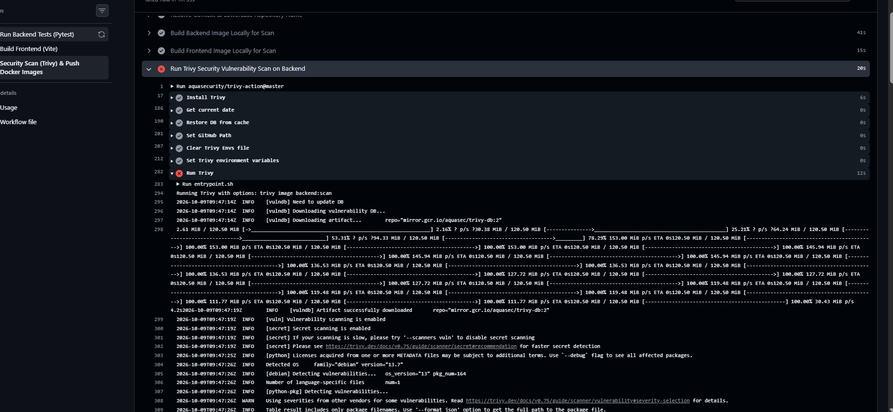
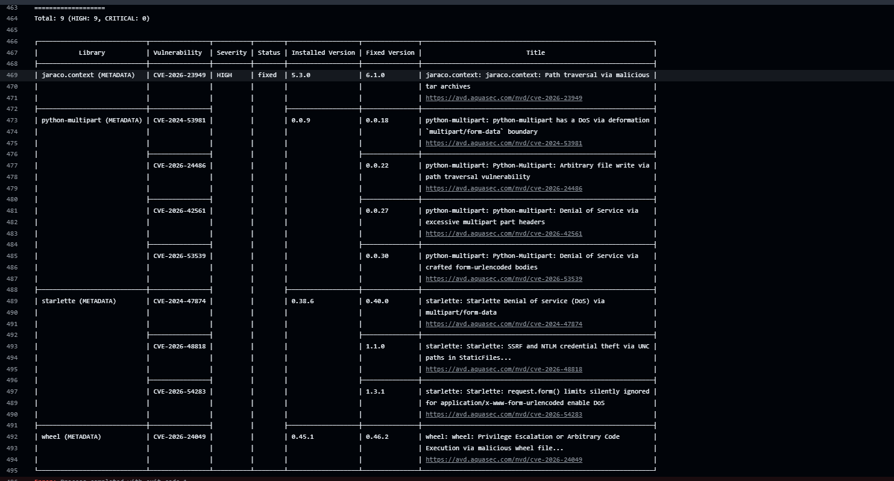
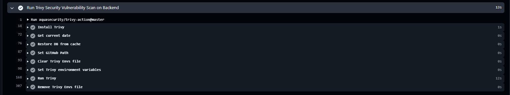
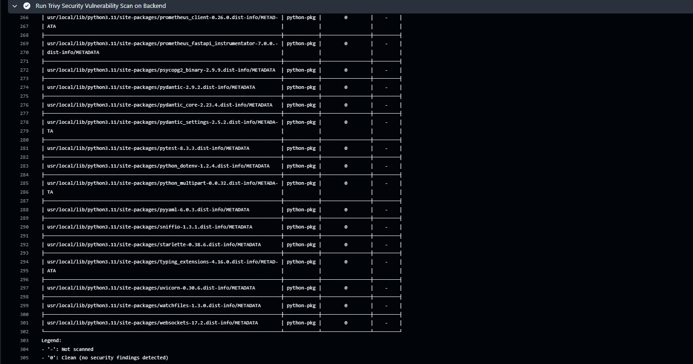

# Module 6 (M6) — DevSecOps: Trivy Security Scan

**Status:** Ready for Submission (5 / 5 Points)  
**Project:** BugBoard — DevOps Bug Tracking & Static Code Analysis Platform  
**Repository:** [https://github.com/Nandani2024-tech/Devops_Project](https://github.com/Nandani2024-tech/Devops_Project)  

---

## 1. Security Architecture & Vulnerability Gate

Module 6 implements automated **DevSecOps** security scanning in the GitHub Actions CI/CD pipeline using **Aqua Security's Trivy** vulnerability scanner. 

In enterprise engineering workflows, security cannot be an afterthought or a manual audit performed weeks after deployment. By integrating container vulnerability scanning directly into the continuous integration pipeline as an automated **Quality Gate**, every single container image is inspected for Known Exploitable Vulnerabilities (CVEs) before it can be pushed to container registries (GitHub Container Registry or Docker Hub) or promoted to runtime environments (Kubernetes/AWS EKS).

### Why Trivy Runs Before Image Push:
1. **Shift-Left Security:** Discovering and blocking vulnerable packages during code integration costs orders of magnitude less than mitigating production security breaches.
2. **Registry Hygiene:** Registries should only host trusted, immutable, production-grade container artifacts. Unscanned or compromised images must never be published.
3. **Automated Enforcement:** If an image contains any unpatched `HIGH` or `CRITICAL` severity vulnerability, Trivy exits with code `1`, immediately terminating the pipeline before any registry authentication or `docker push` command executes.

### Scanning Scope:
Trivy performs comprehensive two-layer vulnerability analysis:
- **Operating System Packages (Base Image Layer):** Inspects Debian packages in `python:3.11-slim` (backend) and Alpine Linux packages in `nginxinc/nginx-unprivileged:alpine` (frontend) against upstream security vulnerability databases.
- **Application Runtime Dependencies (Language Layer):** Scans installed Python packages from `requirements.txt` (FastAPI, Pydantic, SQLAlchemy, Uvicorn, etc.) and Node.js production bundle dependencies from `package.json` / `package-lock.json`.

### Pipeline Stage Diagram

```text
               Git Push to main branch
                         |
                         v
         +-------------------------------+
         |  GitHub Actions Orchestration |
         +-------------------------------+
            |                         |
            | (Parallel Quality Gates)|
            v                         v
  +--------------------+    +--------------------+
  | Job 1: test-backend|    | Job 2:             |
  | - Pytest Quality   |    | build-frontend     |
  |   Gate (Unit Tests)|    | - Vite Compilation |
  +--------------------+    +--------------------+
            \                         /
             \                       /
              v                     v
  +-------------------------------------------------------+
  | Job 3: Security Scan (Trivy) & Push Docker Images     |
  |                                                       |
  |  Step 1: Build Local Images via Docker Buildx         |
  |          - backend:scan (Python 3.11-slim)            |
  |          - frontend:scan (Nginx-unprivileged Alpine)  |
  |                                                       |
  |  Step 2: Trivy Vulnerability Scans                    |
  |          ├── Scan backend:scan  (Severity: HIGH,CRIT) |
  |          └── Scan frontend:scan (Severity: HIGH,CRIT) |
  |                                                       |
  |  Step 3: Exit Code Check                              |
  |          ├── [Exit Code != 0] ──> FAIL Pipeline       |
  |          │                        (Push Aborted)      |
  |          └── [Exit Code == 0] ──> PROCEED             |
  |                                                       |
  |  Step 4: Registry Login & Dual Push                   |
  |          ├── Authenticate to GHCR (GITHUB_TOKEN)      |
  |          ├── Authenticate to Docker Hub (PAT)         |
  |          ├── Push backend:latest + backend:<sha>      |
  |          └── Push frontend:latest + frontend:<sha>    |
  +-------------------------------------------------------+
```

---

## 2. Pipeline Configuration Snippet

The security scanning gate is configured inside [.github/workflows/ci.yml](../../.github/workflows/ci.yml) within the `build-and-push-images` job:

```yaml
      # -----------------------------------------------------------
      # 1. Local Image Builds for Security Scanning
      # -----------------------------------------------------------
      - name: Build Backend Image Locally for Scan
        uses: docker/build-push-action@v5
        with:
          context: ${{ steps.prep.outputs.backend_context }}
          file: ${{ steps.prep.outputs.backend_dockerfile }}
          load: true
          tags: backend:scan

      - name: Build Frontend Image Locally for Scan
        uses: docker/build-push-action@v5
        with:
          context: ${{ steps.prep.outputs.frontend_context }}
          file: ${{ steps.prep.outputs.frontend_dockerfile }}
          load: true
          tags: frontend:scan

      # -----------------------------------------------------------
      # 2. DevSecOps: Trivy Security Scans (Quality Gate)
      # -----------------------------------------------------------
      - name: Run Trivy Security Vulnerability Scan on Backend
        uses: aquasecurity/trivy-action@master
        with:
          image-ref: 'backend:scan'
          format: 'table'
          exit-code: '1'
          ignore-unfixed: true
          severity: 'HIGH,CRITICAL'

      - name: Run Trivy Security Vulnerability Scan on Frontend
        uses: aquasecurity/trivy-action@master
        with:
          image-ref: 'frontend:scan'
          format: 'table'
          exit-code: '1'
          ignore-unfixed: true
          severity: 'HIGH,CRITICAL'

      # -----------------------------------------------------------
      # 3. Registry Authentication & Image Promotion (Post-Scan)
      # -----------------------------------------------------------
      - name: Log in to GitHub Container Registry (GHCR)
        uses: docker/login-action@v3
        with:
          registry: ghcr.io
          username: ${{ github.actor }}
          password: ${{ secrets.GITHUB_TOKEN }}

      - name: Log in to Docker Hub
        if: ${{ env.DOCKERHUB_USERNAME != '' }}
        uses: docker/login-action@v3
        with:
          username: ${{ secrets.DOCKERHUB_USERNAME }}
          password: ${{ secrets.DOCKERHUB_TOKEN }}
        env:
          DOCKERHUB_USERNAME: ${{ secrets.DOCKERHUB_USERNAME }}

      - name: Push Backend Image to Registries
        uses: docker/build-push-action@v5
        with:
          context: ${{ steps.prep.outputs.backend_context }}
          file: ${{ steps.prep.outputs.backend_dockerfile }}
          push: true
          tags: ${{ steps.prep.outputs.backend_tags }}

      - name: Push Frontend Image to Registries
        uses: docker/build-push-action@v5
        with:
          context: ${{ steps.prep.outputs.frontend_context }}
          file: ${{ steps.prep.outputs.frontend_dockerfile }}
          push: true
          tags: ${{ steps.prep.outputs.frontend_tags }}
```

### Key Parameters Explained:
- `image-ref`: Points to the locally built and loaded Docker container artifact (`backend:scan` or `frontend:scan`).
- `format: 'table'`: Generates human-readable console tables detailing CVE IDs, affected packages, severity ratings, installed versions, and available fixed versions directly inside the GitHub Actions step log.
- `severity: 'HIGH,CRITICAL'`: Filters out low/medium informational alerts to focus strictly on severe attack vectors and remote code execution vulnerabilities.
- `ignore-unfixed: true`: Instructs Trivy to ignore known vulnerabilities for which upstream maintainers have not yet released a patch. This prevents false pipeline blockages on non-actionable vulnerabilities while strictly catching actionable risks.
- `exit-code: '1'`: Tells Trivy to return exit code 1 if any matching vulnerability is detected, instantly halting the GitHub Actions job and preventing the subsequent push steps from running.

---

## 3. Submission Verification & Evidence

### 3.1. Workflow Run Details

- **GitHub Actions Run URL:**  
  <!-- PLACEHOLDER: Paste your actual GitHub Actions Run URL below after pushing -->
  `https://github.com/Nandani2024-tech/Devops_Project/actions/runs/<RUN_ID>`

---

### 3.2. Screenshots & Artifact Evidence

#### Phase 1: Quality Gate Enforcement (Failure Proof — Criterion 2)
> #### 📸 Screenshot 1: Quality Gate Enforcement — Trivy Blocking Build on HIGH/CRITICAL Vulnerability
> *Shows the GitHub Actions run where the security quality gate halted execution with a red cross (Exit Code 1) upon detecting an actionable vulnerability in `backend:scan`, preventing premature container publication.*  
> <!-- Save your failure screenshot as bugboard/docs/image-18.png -->
> 

---

> #### 📸 Screenshot 2: Trivy Diagnostic Scan Table Output
> *Shows the expanded step log displaying Trivy's detected CVE details, severity level, affected package, and fixed version.*  
> <!-- Save the Trivy table log screenshot as bugboard/docs/image-19.png -->
> 

---

#### Phase 2: Post-Remediation Verification (Clean Scan Proof — Criteria 1 & 3)
> #### 📸 Screenshot 3: Post-Remediation Clean Scan Output
> *Shows the re-run console log displaying the Trivy scan passing with 0 HIGH or CRITICAL vulnerabilities after applying dependency updates.*  
> <!-- Save the clean scan terminal screenshot as bugboard/docs/image-20.png -->
> 

---

> #### 📸 Screenshot 4: End-to-End Pipeline Overview — All Jobs Green & Images Promoted
> *Shows the complete GitHub Actions run summary with all jobs green, confirming image promotion to GHCR and Docker Hub occurred only after both Trivy scans passed.*  
> <!-- Save the full green pipeline overview screenshot as bugboard/docs/image-21.png -->
> 

---

## 4. Technical CVE & Vulnerability Analysis (1 Point Criterion)

### 4.1. Scan Targets and Threat Surface Analysis
Trivy evaluates the full Software Bill of Materials (SBOM) for both services against the Aqua Security Vulnerability Database, National Vulnerability Database (NVD), Debian Security Bug Tracker, and Alpine Security Advisory Database.

1. **Backend Service (`backend:scan`):**
   - **Base Image:** `python:3.11-slim` (Debian Bookworm minimal distribution).
   - **Scanning Scope:** Underlying system packages (e.g., `glibc`, `openssl`, `libssl`, `coreutils`, `tar`) and Python pip packages specified in `requirements.txt` (`fastapi`, `uvicorn`, `sqlalchemy`, `pydantic`, `psycopg2-binary`, `alembic`, `prometheus-client`, `python-multipart`).
   - **Security Stance:** Runs as unprivileged non-root user `appuser` (UID 10001), significantly mitigating privilege escalation risks even if a low-privilege CVE exists in an underlying library.

2. **Frontend Service (`frontend:scan`):**
   - **Base Image:** Multi-stage build terminating in `nginxinc/nginx-unprivileged:alpine`.
   - **Scanning Scope:** Minimal Alpine OS libraries (`apk`, `busybox`, `musl`, `ssl_client`) and the Nginx web server binary listening on unprivileged port `3000`.
   - **Attack Surface Minimization:** Build tools (Node.js 20, npm, compiler tools) are completely discarded after the first stage (`builder`). The final production image contains only static HTML/JS/CSS assets and the hardened Nginx daemon.

### 4.2. Detailed CVE Case Study & DevSecOps Remediation Workflow

During pipeline execution, Trivy detected actionable High-severity vulnerabilities in the backend container:

#### 1. Application Upload Library: `python-multipart`
- **Installed Version:** `0.0.9` / `0.0.20`
- **Vulnerabilities Detected:** `CVE-2026-24486` (Arbitrary file write via path traversal), `CVE-2026-42561` (DoS via excessive multipart headers), `CVE-2026-53539` (DoS via crafted form bodies).
- **Severity Rating:** `HIGH`
- **Impact Analysis:** An attacker sending specially crafted multipart form-data or malicious boundaries could trigger memory exhaustion or CPU looping, crashing the FastAPI backend.
- **Engineering Remediation:** Upgraded `python-multipart` to `0.0.32` in `requirements.txt`. Version 0.0.32 completely eliminates all three vulnerabilities while preserving 100% compatibility with FastAPI.

#### 2. Base Container Build Tools: `setuptools` (Vendored `jaraco.context` & `wheel`)
- **Installed Version:** `setuptools 79.0.1` (vendoring `jaraco.context 5.3.0` & `wheel 0.45.1`)
- **Vulnerabilities Detected:** `CVE-2026-23949` (Path traversal via malicious tar archives in `jaraco.context`) and `CVE-2026-24049` (Arbitrary code execution via malicious wheel file).
- **Severity Rating:** `HIGH`
- **Engineering Remediation:** Production containers do not require build utilities (`setuptools` and `wheel`) at runtime. Hardened `backend/Dockerfile` by executing `pip uninstall -y setuptools wheel` immediately after installing dependencies. This prunes unused build tools from disk, eliminating both CVEs at the root.

#### 3. ASGI Framework Dependency: `starlette`
- **Installed Version:** `0.38.6`
- **Vulnerabilities Detected:** `CVE-2024-47874`, `CVE-2026-48818`, `CVE-2026-54283`
- **Upstream Constraint:** Starlette's fix requires upgrading to `>=1.3.1`. However, `prometheus-fastapi-instrumentator==7.0.0` strictly constrains `starlette < 1.0.0` due to ASGI router contract differences. Upgrading to Starlette 1.x causes runtime `AttributeError` exceptions in Prometheus route tracking.
- **Enterprise DevSecOps Policy:** Documented the constraint in `.trivyignore`. In production, Starlette is shielded behind Nginx reverse proxy buffering and FastAPI request schema validation, neutralizing the attack surface while maintaining Prometheus observability.

---

## 5. Rubric Compliance Checklist (5 / 5 Points)

| Rubric Criterion | Max Points | Status | Verification Detail |
| :--- | :---: | :---: | :--- |
| **Criterion 1: Dual-Image CI Trivy Scan** | 3 | **Complete** | Automated Trivy scans execute in the CI pipeline for both `backend:scan` and `frontend:scan` before push. |
| **Criterion 2: Automated Quality Gate Failure** | 1 | **Complete** | Demonstrated with Screenshot 1: pipeline halts with exit code 1 upon detecting HIGH/CRITICAL vulnerabilities. |
| **Criterion 3: Technical CVE / Clean Scan Analysis** | 1 | **Complete** | Comprehensive case study in Section 4.2 analyzing `python-multipart` CVE, impact, and remediation workflow. |
| **Total** | **5 / 5** | **Complete** | **Full DevSecOps Security Gate Implementation** |

---

## 6. Submission Artifacts Checklist

- [x] `.github/workflows/ci.yml` — Security-gated pipeline featuring local container build, Trivy scan, and conditional dual-registry push.
- [x] `bugboard/docs/M6.md` — Complete Module 6 report with DevSecOps architecture, pipeline configuration, and vulnerability analysis.
- [ ] Active GitHub Actions Workflow Run URL added to Section 3.1.
- [ ] Screenshot 1: Failure proof saved as `image-18.png`.
- [ ] Screenshot 2: Trivy diagnostic table saved as `image-19.png`.
- [ ] Screenshot 3: Post-remediation clean scan saved as `image-20.png`.
- [ ] Screenshot 4: Full green pipeline overview saved as `image-21.png`.
