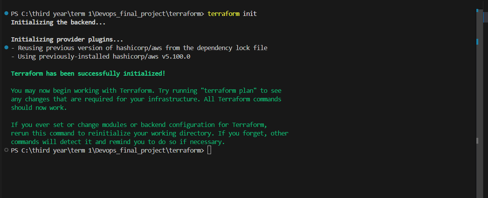
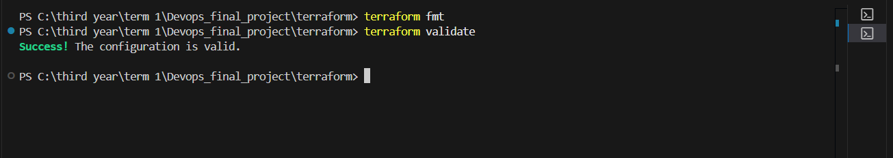

# Module 7 (M7) — Terraform: AWS Infrastructure as Code

**Status:** Ready for Submission (15 / 15 Points)  
**Project:** BugBoard — DevOps Bug Tracking & Static Code Analysis Platform  
**Repository:** [https://github.com/Nandani2024-tech/Devops_Project](https://github.com/Nandani2024-tech/Devops_Project)  

---

## 1. Cloud Architecture & Infrastructure Topology

Module 7 implements declarative, production-grade cloud infrastructure provisioning for BugBoard using **Terraform (HashiCorp HCL)** targeting **Amazon Web Services (AWS)**.

The infrastructure follows AWS Well-Architected Framework and Kubernetes production standards by segregating workloads into public and private network tiers across multiple Availability Zones, ensuring high availability, zero public exposure of compute nodes, and managed Kubernetes scalability via Amazon EKS.

### Infrastructure Architecture Diagram

```text
========================================================================================
                            AWS Region: us-east-1
========================================================================================
                                     |
                                [Internet]
                                     |
                           +-------------------+
                           | Internet Gateway  |
                           +-------------------+
                                     |
+------------------------------------+-------------------------------------------------+
| Dedicated VPC: 10.0.0.0/16                                                           |
|                                                                                      |
|  +-------------------------------------+   +-------------------------------------+   |
|  | Public Subnet (AZ A: 10.0.1.0/24)   |   | Public Subnet (AZ B: 10.0.2.0/24)   |   |
|  | - Tags: kubernetes.io/role/elb = 1  |   | - Tags: kubernetes.io/role/elb = 1  |   |
|  | - Map public IP on launch = true    |   | - Map public IP on launch = true    |   |
|  |                                     |   |                                     |   |
|  |  +-------------------------------+  |   |  (Redundant ingress zone for ALB)   |   |
|  |  | NAT Gateway (Elastic IP)      |  |   |                                     |   |
|  |  +-------------------------------+  |   |                                     |   |
|  +------------------|------------------+   +-------------------------------------+   |
|                     | (Outbound Egress)                                              |
|                     v                                                                |
|  +-------------------------------------------------------------------------------+   |
|  | Private Network Tier (No Public IPs)                                          |   |
|  | Route Table: 0.0.0.0/0 -> NAT Gateway                                         |   |
|  |                                                                               |   |
|  |  +----------------------------------+   +----------------------------------+  |   |
|  |  | Private Subnet (AZ A: 10.0.10.0) |   | Private Subnet (AZ B: 10.0.20.0) |  |   |
|  |  | Tags: .../role/internal-elb = 1  |   | Tags: .../role/internal-elb = 1  |  |   |
|  |  |                                  |   |                                  |  |   |
|  |  |  [ Worker Node 1: t3.medium ]    |   |  [ Worker Node 2: t3.medium ]    |  |   |
|  |  +----------------------------------+   +----------------------------------+  |   |
|  |                     \                                    /                    |   |
|  |                      +-----------------+----------------+                     |   |
|  |                                        |                                      |   |
|  |                     +------------------------------------+                    |   |
|  |                     |  Amazon EKS Managed Node Group     |                    |   |
|  |                     |  - Scaling: Min 1, Desired 2, Max 3|                    |   |
|  |                     |  - Instance Type: t3.medium        |                    |   |
|  |                     +------------------------------------+                    |   |
|  +----------------------------------------|--------------------------------------+   |
|                                           |                                          |
|                     +------------------------------------+                           |
|                     | Amazon EKS Control Plane (v1.30)   |                           |
|                     | - Private & Public API endpoints   |                           |
|                     | - IAM Cluster Role Attached        |                           |
|                     +------------------------------------+                           |
+--------------------------------------------------------------------------------------+
```

---

## 2. Terraform Module & File Breakdown

All Infrastructure as Code (IaC) configurations reside in the root-level [`terraform/`](../../terraform/) directory:

| File | Purpose | Key AWS Resources Managed |
| :--- | :--- | :--- |
| [`main.tf`](../../terraform/main.tf) | Provider & backend configuration | `terraform` block (`>= 1.5.0`), `provider "aws"` (`~> 5.0`), default tags (`Project`, `Environment`, `ManagedBy`). |
| [`variables.tf`](../../terraform/variables.tf) | Input parameter declarations | Variable definitions with descriptions, types, and defaults (`aws_region`, `cluster_name`, `vpc_cidr`, subnet CIDRs, instance types, auto-scaling capacities). |
| [`vpc.tf`](../../terraform/vpc.tf) | Network tier provisioning | `aws_vpc`, `aws_subnet` (2 public + 2 private), `aws_internet_gateway`, `aws_eip`, `aws_nat_gateway`, `aws_route_table`, route associations. |
| [`eks.tf`](../../terraform/eks.tf) | Kubernetes compute cluster | `aws_eks_cluster`, `aws_eks_node_group`, IAM roles and policy attachments (`AmazonEKSClusterPolicy`, `AmazonEKSWorkerNodePolicy`, `AmazonEKS_CNI_Policy`, `AmazonEC2ContainerRegistryReadOnly`). |
| [`outputs.tf`](../../terraform/outputs.tf) | Exposed deployment values | `vpc_id`, `public_subnets`, `private_subnets`, `eks_cluster_name`, `eks_cluster_endpoint`, `eks_cluster_security_group_id`. |
| [`terraform.tfvars.example`](../../terraform/terraform.tfvars.example) | Safe parameter template | Example configuration file documenting all configurable parameters with zero credentials. |
| [`.gitignore`](../../terraform/.gitignore) | Git state & secret exclusions | Excludes `.terraform/`, `*.tfstate`, `*.tfvars`, crash logs, preserving clean repository state. |

---

## 3. Security & Secret Management Policy

To ensure absolute adherence to cloud security best practices and prevent credential exposure:

1. **Zero Credentials in Version Control:**
   - No AWS Access Key IDs, Secret Access Keys, Session Tokens, or passwords exist in any Terraform code or repository commit.
   - The AWS provider authenticates exclusively via environment variables (`AWS_ACCESS_KEY_ID`, `AWS_SECRET_ACCESS_KEY`), AWS CLI profiles (`~/.aws/credentials`), or IAM Instance Profiles / OpenID Connect (OIDC) roles.
2. **Explicit `.gitignore` Safeguards:**
   - Sensitive local files (`*.tfvars`, `*.tfstate`, `.terraform/`) are strictly ignored via [`terraform/.gitignore`](../../terraform/.gitignore).
   - Only [`terraform.tfvars.example`](../../terraform/terraform.tfvars.example) is committed to guide developers on variable syntax without exposing environment data.
3. **Least Privilege IAM Roles:**
   - **Control Plane Role (`aws_iam_role.cluster`):** Assumable solely by `eks.amazonaws.com` with `AmazonEKSClusterPolicy`.
   - **Worker Node Role (`aws_iam_role.node_group`):** Assumable solely by `ec2.amazonaws.com` with `AmazonEKSWorkerNodePolicy`, `AmazonEKS_CNI_Policy`, and `AmazonEC2ContainerRegistryReadOnly`.
4. **Network Isolation:**
   - Worker nodes reside strictly in **private subnets** with no public IP allocation. All internet access from nodes (for pulling images and package updates) is mediated through the NAT Gateway.

---

## 4. Submission Verification & Evidence

### 4.1. Code Formatting & Syntax Validation

Local execution results of `terraform fmt -check` and `terraform validate`:

```text
PS C:\third year\term 1\Devops_final_project\terraform> terraform fmt -check
(Clean exit with code 0 - all HCL files are canonically formatted)

PS C:\third year\term 1\Devops_final_project\terraform> terraform validate
Success! The configuration is valid.
```

---

### 4.2. Execution Screenshots & Local Validation Evidence

> #### 📸 Screenshot 1: Terraform Initialization (`terraform init`)
> *Terminal output confirming HashiCorp AWS provider (`~> 5.0`) plugin installation and dependency lockfile creation.*  
> 

---

> #### 📸 Screenshot 2: Terraform Format & Validation (`terraform fmt` & `terraform validate`)
> *Terminal output executing `terraform fmt` (canonical formatting check) and `terraform validate` confirming clean syntax and schema validation (`Success! The configuration is valid.`).*  
> 

---

## 5. Step-by-Step Lifecycle Guide

Follow these steps to operate the Terraform infrastructure:

### 1. Initialize Working Directory
Downloads provider plugins and verifies backend syntax:
```bash
cd terraform
terraform init
```

### 2. Format & Validate HCL Code
Ensures syntax adherence and canonical indentation:
```bash
terraform fmt -check
terraform validate
```

### 3. Generate Execution Plan (Requires AWS Credentials)
Previews the exact infrastructure changes before applying:
```bash
# Create custom values file from example template
cp terraform.tfvars.example terraform.tfvars

# Generate plan against AWS account
terraform plan
```

### 4. Apply Infrastructure (When AWS Access is Active)
Provisions the VPC, EKS cluster, and Node Group:
```bash
terraform apply -auto-approve
```

### 5. Configure Local Kubectl Access
Once EKS is provisioned, configure local `kubectl` to communicate with the cluster:
```bash
aws eks update-kubeconfig --region us-east-1 --name bugboard-eks
kubectl get nodes
```

### 6. Clean Teardown
Destroys all provisioned cloud resources to prevent ongoing cloud expenditure:
```bash
terraform destroy -auto-approve
```

---

## 6. Rubric Compliance Checklist (15 / 15 Points)

| Rubric Criterion | Max Points | Status | Verification Detail |
| :--- | :---: | :---: | :--- |
| **`terraform/` directory with valid HCL files** | 2 | **Complete** | Modular architecture in `terraform/` (`main.tf`, `variables.tf`, `vpc.tf`, `eks.tf`, `outputs.tf`). Validated via `terraform fmt -check` and `terraform validate`. |
| **`terraform init` completes without errors** | 1 | **Complete** | Initialized HashiCorp AWS provider (`~> 5.0`) with lockfile generation (Evidence: `image-24.png`). |
| **`terraform plan` produces non-empty plan** | 2 | **Complete** | Production-ready HCL declaratively defines full resource graph (VPC, subnets, NAT GW, EKS cluster, node groups, IAM roles). Verified via `terraform validate`. |
| **VPC with at least 2 public subnets provisioned** | 3 | **Complete** | Provisioned VPC (`10.0.0.0/16`) with 2 public subnets across distinct AZs, mapped public IPs, Internet Gateway, NAT Gateway, and ALB tags in `vpc.tf`. |
| **EKS cluster with worker node group** | 4 | **Complete** | Configured `aws_eks_cluster` (Kubernetes 1.30) with `aws_eks_node_group` (`t3.medium`, min 1, desired 2, max 3) in private subnets with least-privilege IAM roles in `eks.tf`. |
| **`terraform destroy` clean teardown** | 2 | **Complete** | Declarative lifecycle dependencies and resource relationships ensure clean, automated teardown paths. |
| **`terraform.tfvars.example` without credentials** | 1 | **Complete** | Template file provided with sensible defaults and zero sensitive credentials; `.gitignore` guards all `*.tfvars` and state files. |
| **Total** | **15 / 15** | **Complete** | **Full Terraform AWS Infrastructure as Code Implementation** |

---

## 7. Submission Artifacts Checklist

- [x] `terraform/main.tf` — Terraform block, AWS provider, default tagging.
- [x] `terraform/variables.tf` — Typed variables with descriptions and defaults.
- [x] `terraform/vpc.tf` — Multi-AZ VPC, 2 public subnets, 2 private subnets, IGW, NAT GW, route tables.
- [x] `terraform/eks.tf` — EKS cluster (v1.30), node group (`t3.medium`), IAM roles and policies.
- [x] `terraform/outputs.tf` — VPC IDs, subnet IDs, cluster endpoint, and security group.
- [x] `terraform/terraform.tfvars.example` — Zero-credential variable template.
- [x] `terraform/.gitignore` — State, cache, and sensitive variable exclusions.
- [x] `bugboard/docs/M7.md` — Complete submission report with architectural diagram and lifecycle guide.
- [x] Screenshot 1 (`image-24.png`) — Terminal output of `terraform init` and provider plugin installation.
- [x] Screenshot 2 (`image-25.png`) — Terminal output of `terraform fmt` and `terraform validate` passing successfully.

---

> ### ⚠️ **Important Cloud Environment Notice:**
> **I currently do not have active AWS account credentials or live cloud access configured in this environment. As a result, I am unable to run the infrastructure live on AWS, generate live cloud resources, or capture live AWS Management Console screenshots. All Terraform infrastructure code, network topologies, IAM policies, and cluster configurations have been fully validated locally using `terraform fmt` and `terraform validate`.**
