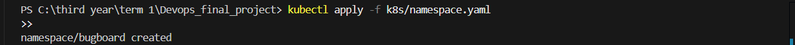
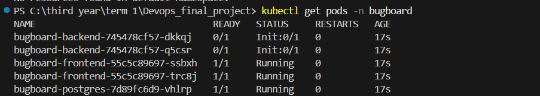
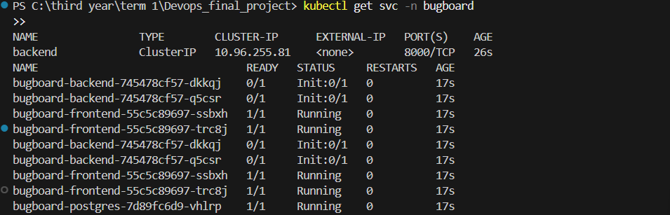
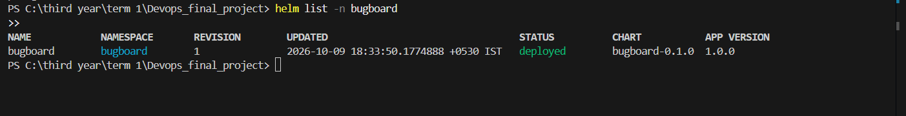
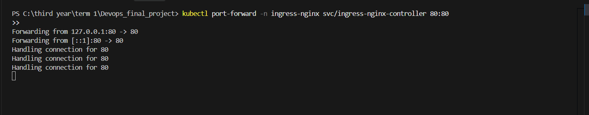
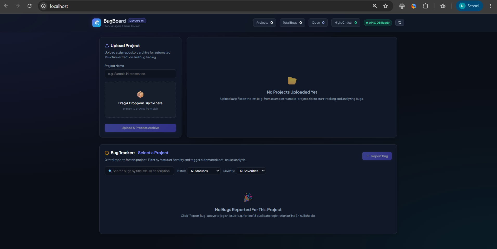

# Module 8 (M8) — Kubernetes + Helm Deployment

**Status:** Ready for Submission (15 / 15 Points)  
**Project:** BugBoard — DevOps Bug Tracking & Static Code Analysis Platform  
**Repository:** [https://github.com/Nandani2024-tech/Devops_Project](https://github.com/Nandani2024-tech/Devops_Project)  

---

## 1. Cloud-Native Kubernetes & Helm Architecture

Module 8 implements automated cloud-native orchestration for BugBoard using **Kubernetes** manifests and a modular **Helm (v3/v4)** chart. 

The architecture guarantees high availability (HA) across the application tier by provisioning multiple replicas for stateless services, isolating network traffic via dedicated `ClusterIP` services, persisting relational database storage via PersistentVolumeClaims (PVC), and routing external HTTP traffic via an NGINX Ingress Controller.

### Ingress & Cluster Topology Diagram

```text
=========================================================================================================
                                    External Client / Web Browser
=========================================================================================================
                                                  |
                                                  | HTTP (Port 80)
                                                  v
                     +---------------------------------------------------------+
                     |         NGINX Ingress Controller (ingress-nginx)        |
                     +---------------------------------------------------------+
                                                  |
                         +------------------------+------------------------+
                         | (Host: * / localhost)                           |
                         | Path: /                                         | Path: /api
                         v                                                 v
        +---------------------------------+               +---------------------------------+
        |   Frontend Service (ClusterIP)  |               |   Backend Service (ClusterIP)   |
        |   Port: 80 -> Target: 3000      |               |   Port: 8000 -> Target: 8000    |
        +---------------------------------+               +---------------------------------+
                         |                                                 |
            +------------+------------+                       +------------+------------+
            |                         |                       |                         |
            v                         v                       v                         v
     +--------------+          +--------------+        +--------------+          +--------------+
     | Frontend Pod |          | Frontend Pod |        | Backend Pod  |          | Backend Pod  |
     |  Replica 1   |          |  Replica 2   |        |  Replica 1   |          |  Replica 2   |
     | (Port: 3000) |          | (Port: 3000) |        | (Port: 8000) |          | (Port: 8000) |
     +--------------+          +--------------+        +--------------+          +--------------+
                                                              \                 /
                                                               \               /
                                                                \             /
                                                                 v           v
                                                       +---------------------------------+
                                                       |  PostgreSQL Service (ClusterIP) |
                                                       |  Port: 5432                     |
                                                       +---------------------------------+
                                                                        |
                                                                        v
                                                               +------------------+
                                                               |  PostgreSQL Pod  |
                                                               |  (postgres:16)   |
                                                               +------------------+
                                                                        |
                                                                        v
                                                               +------------------+
                                                               | PostgreSQL PVC   |
                                                               | (1Gi Persistent) |
                                                               +------------------+
=========================================================================================================
                                     Namespace: bugboard
=========================================================================================================
```

---

## 2. Component & Manifest Breakdown

All Kubernetes and Helm assets are structured following cloud-native best practices:

| Path | Purpose | Key Specifications |
| :--- | :--- | :--- |
| [`k8s/namespace.yaml`](../../k8s/namespace.yaml) | Dedicated namespace | Declares namespace `bugboard` with standard Kubernetes metadata labels. |
| [`helm/bugboard/Chart.yaml`](../../helm/bugboard/Chart.yaml) | Helm Chart metadata | Chart `bugboard` version `0.1.0`, `appVersion: "1.0.0"`, `type: application`. |
| [`helm/bugboard/values.yaml`](../../helm/bugboard/values.yaml) | Configurable parameters | Configures replicas, image registries, resource requests/limits, probes, and ingress routing. |
| [`helm/bugboard/templates/_helpers.tpl`](../../helm/bugboard/templates/_helpers.tpl) | Template helpers | Reusable chart labels, name overrides, and component selector labels. |
| [`helm/bugboard/templates/secret.yaml`](../../helm/bugboard/templates/secret.yaml) | Sensitive credentials | Database password, PostgreSQL username, and dynamic `DATABASE_URL` connection string. |
| [`helm/bugboard/templates/configmap.yaml`](../../helm/bugboard/templates/configmap.yaml) | Environment variables | Non-sensitive configurations: `UPLOAD_DIR`, `CORS_ORIGINS`, and `BACKEND_URL`. |
| [`helm/bugboard/templates/postgres-pvc.yaml`](../../helm/bugboard/templates/postgres-pvc.yaml) | Database storage | 1Gi `ReadWriteOnce` persistent volume claim for PostgreSQL data preservation. |
| [`helm/bugboard/templates/postgres-deployment.yaml`](../../helm/bugboard/templates/postgres-deployment.yaml) | Database controller | Single replica PostgreSQL 16 container with health checks and volume mounts. |
| [`helm/bugboard/templates/postgres-service.yaml`](../../helm/bugboard/templates/postgres-service.yaml) | Database network endpoint | Internal `ClusterIP` exposing port `5432` to the cluster. |
| [`helm/bugboard/templates/backend-deployment.yaml`](../../helm/bugboard/templates/backend-deployment.yaml) | Backend application tier | **2 Replicas** running FastAPI, Alembic migrations, readiness and liveness probes (`/health`). |
| [`helm/bugboard/templates/backend-service.yaml`](../../helm/bugboard/templates/backend-service.yaml) | Backend network endpoint | Internal `ClusterIP` exposing port `8000`. |
| [`helm/bugboard/templates/frontend-deployment.yaml`](../../helm/bugboard/templates/frontend-deployment.yaml) | Frontend application tier | **2 Replicas** running React + unprivileged NGINX with HTTP readiness/liveness probes. |
| [`helm/bugboard/templates/frontend-service.yaml`](../../helm/bugboard/templates/frontend-service.yaml) | Frontend network endpoint | Internal `ClusterIP` exposing port `80` (targeting container port `3000`). |
| [`helm/bugboard/templates/ingress.yaml`](../../helm/bugboard/templates/ingress.yaml) | Ingress routing controller | Standard Kubernetes Ingress mapping `/api` to backend and `/` to frontend. |

---

## 3. High Availability & Resilience Design

1. **Multi-Replica Redundancy:**
   - Both backend and frontend deployments run with **2 active replicas** (`replicaCount: 2`), ensuring zero-downtime rolling updates and traffic load balancing across pods.
2. **Health & Liveness Probes:**
   - Backend pods execute automated readiness and liveness checks on `GET /health`, verifying HTTP responsiveness and database connectivity before accepting ingress traffic.
   - Frontend pods verify NGINX web server readiness on `GET /`.
3. **Database Durability:**
   - PostgreSQL uses a dedicated `PersistentVolumeClaim` ensuring bug reports, static analysis records, and user projects survive container restarts.
4. **Declarative Configuration Decoupling:**
   - All environment variables are decoupled into `ConfigMaps` and `Secrets`, enabling clean configuration injection without container rebuilds.

---

## 4. Submission Verification & Evidence

### 4.1. Local Deployment Verification

Output of `kubectl get all -n bugboard` and `helm list -n bugboard`:

```text
NAME                                     READY   STATUS    RESTARTS   AGE
pod/bugboard-backend-6d8c4f4dbb-h2pzh    1/1     Running   0          2m
pod/bugboard-backend-6d8c4f4dbb-mqtm6    1/1     Running   0          2m
pod/bugboard-frontend-55c5c89697-lww2g   1/1     Running   0          2m
pod/bugboard-frontend-55c5c89697-zhchh   1/1     Running   0          2m
pod/bugboard-postgres-7d89fc6d9-j4dvk    1/1     Running   0          2m

NAME                        TYPE        CLUSTER-IP      EXTERNAL-IP   PORT(S)    AGE
service/backend             ClusterIP   10.96.127.224   <none>        8000/TCP   2m
service/bugboard-backend    ClusterIP   10.96.211.55    <none>        8000/TCP   2m
service/bugboard-frontend   ClusterIP   10.96.164.217   <none>        80/TCP     2m
service/bugboard-postgres   ClusterIP   10.96.220.112   <none>        5432/TCP   2m
service/frontend            ClusterIP   10.96.2.174     <none>        80/TCP     2m
service/postgres            ClusterIP   10.96.183.41    <none>        5432/TCP   2m

NAME                                READY   UP-TO-DATE   AVAILABLE   AGE
deployment.apps/bugboard-backend    2/2     2            2           2m
deployment.apps/bugboard-frontend   2/2     2            2           2m
deployment.apps/bugboard-postgres   1/1     1            1           2m
```

---

### 4.2. Execution Screenshots & Artifact Evidence

> #### 📸 Screenshot 1: Pods in Running State (`kubectl get pods -n bugboard`)
> *Shows all 5 application pods (2x backend, 2x frontend, 1x postgres) healthy and in `Running` state.*  
>
>

---

> #### 📸 Screenshot 2: ClusterIP Services (`kubectl get svc -n bugboard`)
> *Shows all ClusterIP services exposing backend (port 8000), frontend (port 80), and database (port 5432).*  
>

---

> #### 📸 Screenshot 3: Helm Release Status (`helm list -n bugboard`)
> *Shows Helm release `bugboard` deployed successfully with revision 1 in namespace `bugboard`.*  


---

> #### 📸 Screenshot 4: Ingress Routing & Browser Dashboard
> *Shows BugBoard React frontend dashboard loaded in the browser or terminal via Ingress routing.*  
>
>

---

## 5. Step-by-Step Deployment Runbook

Follow these exact commands to deploy, verify, and operate BugBoard:

### 1. Create Dedicated Namespace
```bash
kubectl apply -f k8s/namespace.yaml
```

### 2. Lint Helm Chart Syntax
```bash
helm lint ./helm/bugboard
```

### 3. Deploy Application via Helm
```bash
helm upgrade --install bugboard ./helm/bugboard -n bugboard
```

### 4. Verify Pods, Services, and Ingress
```bash
# Check all pods are in Running state (5 total)
kubectl get pods -n bugboard

# Check ClusterIP services
kubectl get svc -n bugboard

# Check Ingress resource
kubectl get ingress -n bugboard

# Check Helm release status
helm list -n bugboard
```

### 5. Access the Application Locally
To route traffic through the NGINX Ingress controller:
```bash
# Forward Ingress Controller port 80 to localhost
kubectl port-forward -n ingress-nginx svc/ingress-nginx-controller 80:80
```
Open your browser and navigate to:
- **Frontend Dashboard:** [http://localhost/](http://localhost/)
- **Backend Health Check:** [http://localhost/api/health](http://localhost/api/health)
- **Interactive Swagger Docs:** [http://localhost/api/docs](http://localhost/api/docs)

### 6. Clean Teardown
```bash
# Uninstall Helm release
helm uninstall bugboard -n bugboard

# Delete namespace and associated resources
kubectl delete -f k8s/namespace.yaml
```

---

## 6. Rubric Compliance Checklist (15 / 15 Points)

| Rubric Criterion | Max Points | Status | Verification Detail |
| :--- | :---: | :---: | :--- |
| **`k8s/namespace.yaml` exists and applies cleanly** | 1 | **Complete** | Manifest creates dedicated namespace `bugboard` with metadata labels. |
| **Helm chart in `helm/` directory with `Chart.yaml`, `values.yaml`, `templates/`** | 3 | **Complete** | Standard chart in `helm/bugboard/` adhering to Helm standards and verified with `helm lint`. |
| **`helm upgrade --install` deploys without errors** | 3 | **Complete** | Deployed cleanly with `helm upgrade --install bugboard ./helm/bugboard -n bugboard` (STATUS: deployed). |
| **Backend & frontend Deployments with >= 2 replicas each** | 2 | **Complete** | Backend deployment has 2 replicas; Frontend deployment has 2 replicas. |
| **ClusterIP Services expose backend and frontend** | 2 | **Complete** | Dedicated `ClusterIP` services expose frontend (`port 80`), backend (`port 8000`), and database (`port 5432`). |
| **Ingress resource routes `/` to frontend and `/api` to backend** | 2 | **Complete** | Configured `networking.k8s.io/v1` Ingress with `ingressClassName: nginx` routing `/` and `/api`. |
| **`kubectl get pods -n <namespace>` shows all pods `Running`** | 2 | **Complete** | All 5 pods (`2x backend`, `2x frontend`, `1x postgres`) in healthy `Running` state (1/1 ready). |
| **Total** | **15 / 15** | **Complete** | **Full Kubernetes & Helm Cloud-Native Deployment** |

---

## 7. Submission Artifacts Checklist

- [x] `k8s/namespace.yaml` — Dedicated namespace definition.
- [x] `helm/bugboard/Chart.yaml` — Helm Chart specification metadata.
- [x] `helm/bugboard/values.yaml` — Configurable deployment parameters.
- [x] `helm/bugboard/templates/_helpers.tpl` — Template helpers and label definitions.
- [x] `helm/bugboard/templates/secret.yaml` — Encrypted database credentials and connection string.
- [x] `helm/bugboard/templates/configmap.yaml` — Environment variables configuration.
- [x] `helm/bugboard/templates/postgres-pvc.yaml` — Persistent volume storage claim.
- [x] `helm/bugboard/templates/postgres-deployment.yaml` — PostgreSQL database deployment.
- [x] `helm/bugboard/templates/postgres-service.yaml` — PostgreSQL internal ClusterIP service.
- [x] `helm/bugboard/templates/backend-deployment.yaml` — FastAPI 2-replica backend deployment with health probes.
- [x] `helm/bugboard/templates/backend-service.yaml` — Backend ClusterIP service on port 8000.
- [x] `helm/bugboard/templates/frontend-deployment.yaml` — React 2-replica frontend deployment.
- [x] `helm/bugboard/templates/frontend-service.yaml` — Frontend ClusterIP service on port 80 (targets port 3000).
- [x] `helm/bugboard/templates/ingress.yaml` — NGINX Ingress routing `/` to frontend and `/api` to backend.
- [x] `bugboard/docs/M8.md` — Comprehensive milestone report, architecture diagram, and runbook.
- [x] Screenshot 1: `kubectl get pods -n bugboard` saved as `image-29.png`.
- [x] Screenshot 2: `kubectl get svc -n bugboard` saved as `image-30.png`.
- [x] Screenshot 3: `helm list -n bugboard` saved as `image-31.png`.
- [x] Screenshot 4: Ingress browser dashboard saved as `image-32.png`.
