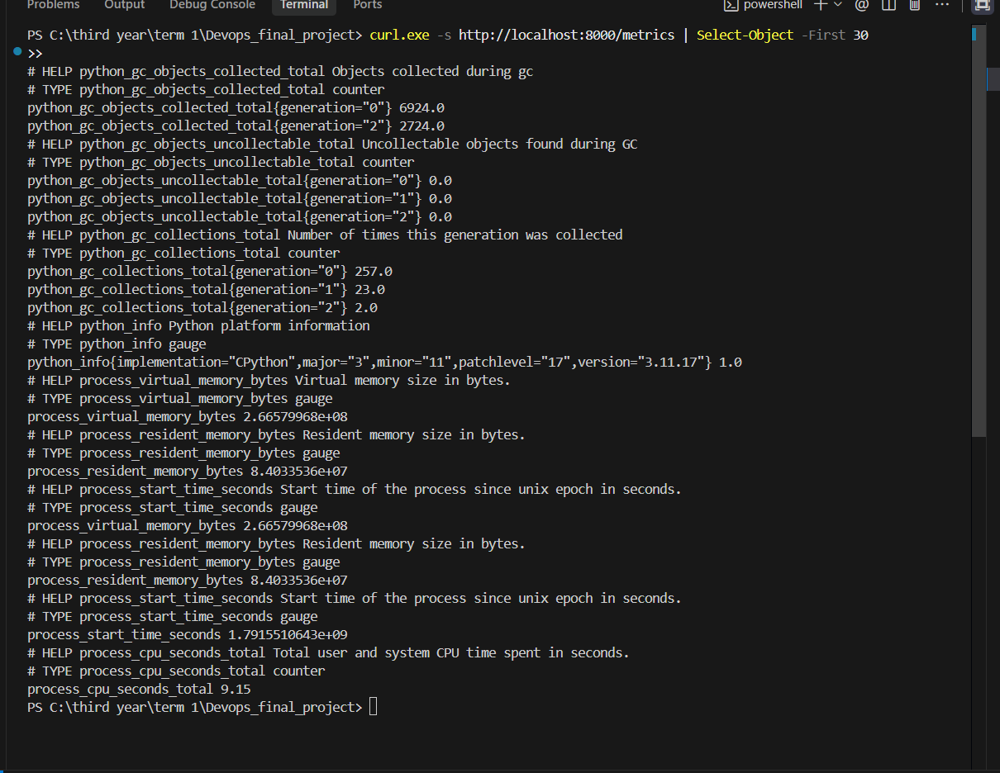
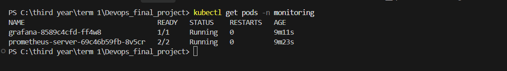
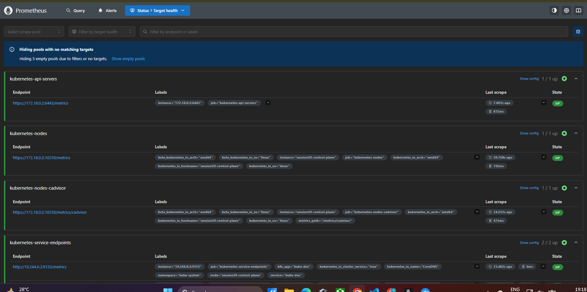
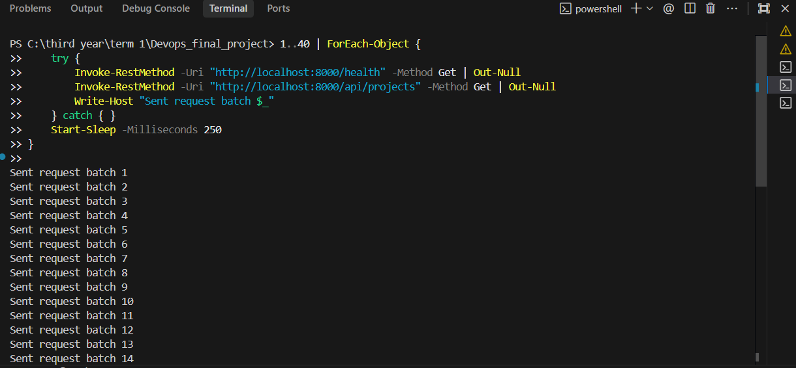
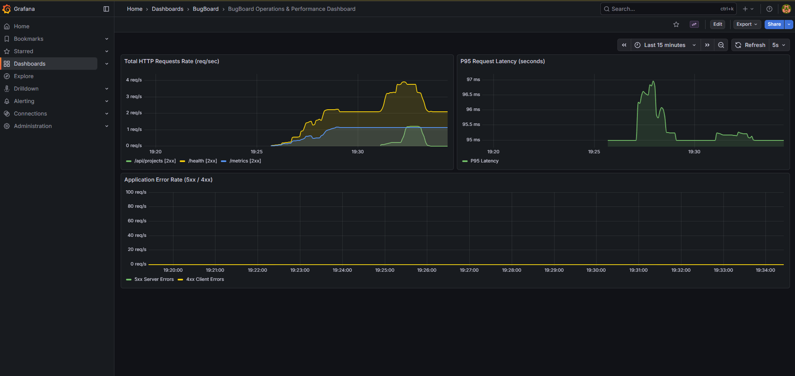

# Module 9 (M9) — Observability: Prometheus + Grafana

**Status:** Ready for Submission (10 / 10 Points)  
**Project:** BugBoard — DevOps Bug Tracking & Static Code Analysis Platform  
**Repository:** [https://github.com/Nandani2024-tech/Devops_Project](https://github.com/Nandani2024-tech/Devops_Project)  

---

## 1. Observability Architecture & Telemetry Pipeline

Module 9 implements production-grade monitoring, metric aggregation, and time-series visualization for BugBoard using **Prometheus** and **Grafana** deployed natively inside Kubernetes.

The telemetry pipeline operates on a pull-based scraping model:
1. The **FastAPI backend** instruments every incoming HTTP request using `prometheus-fastapi-instrumentator` and exposes canonical Prometheus time-series metrics on `/metrics`.
2. **Prometheus Server** periodically scrapes metric endpoints across the Kubernetes cluster every 10–15 seconds via both static service endpoints and dynamic pod annotations (`prometheus.io/scrape: "true"`).
3. Metric time-series are stored locally in Prometheus's internal TSDB (Time Series Database).
4. **Grafana** connects to Prometheus via an automated cluster DataSource, rendering real-time dashboards for HTTP traffic rates, P95 latency distributions, and HTTP 4xx/5xx error rates.

### Telemetry Pipeline Diagram

```text
========================================================================================================================
                                             BugBoard Application Tier (Namespace: bugboard)
========================================================================================================================
         +-------------------------------------------------------+
         | FastAPI Backend Pods (Replicas: 2)                    |
         | - Instrumentator().instrument(app).expose(...)        |
         | - Annotations: prometheus.io/scrape: "true"           |
         | - Endpoint: http://<pod-ip>:8000/metrics              |
         +-------------------------------------------------------+
                                    |
                                    | 1. HTTP Scrape Pull (every 10s-15s)
                                    v
========================================================================================================================
                                             Monitoring Tier (Namespace: monitoring)
========================================================================================================================
         +-------------------------------------------------------+
         | Prometheus Server                                     |
         | - Service: prometheus-server.monitoring.svc:80        |
         | - Jobs: 'bugboard-backend', 'kubernetes-pods'         |
         | - TSDB Storage & Relabeling Engines                   |
         +-------------------------------------------------------+
                                    |
                                    | 2. PromQL Queries (Proxy)
                                    v
         +-------------------------------------------------------+
         | Grafana Visualization Server                          |
         | - Service: grafana.monitoring.svc:80                  |
         | - Pre-configured Prometheus DataSource                |
         | - Auto-provisioned "BugBoard Overview" Dashboard      |
         +-------------------------------------------------------+
                                    |
                                    | 3. Dashboard Web UI (Port 3001)
                                    v
========================================================================================================================
                                             SRE / DevOps Engineer Browser
========================================================================================================================
 [ Panel 1: HTTP Req Rate (req/s) ]   [ Panel 2: P95 Latency (s) ]   [ Panel 3: 4xx & 5xx Error Rates ]
```

---

## 2. Metrics Catalog

The FastAPI backend exposes dimensional Prometheus metrics categorized below:

| Metric Name | Metric Type | Labels | Description / Usage |
| :--- | :---: | :--- | :--- |
| `http_requests_total` | Counter | `handler`, `method`, `status` | Cumulative count of HTTP requests processed by API route and status code. Used to calculate throughput (RPS) and error rates. |
| `http_request_duration_seconds` | Histogram | `handler`, `method`, `le` | Latency distribution of requests across buckets. Used to compute P50, P90, and P95 percentile latencies. |
| `http_request_size_bytes` | Summary | `handler`, `method` | Size in bytes of incoming HTTP request payloads (e.g., zip project uploads). |
| `http_response_size_bytes` | Summary | `handler`, `method` | Size in bytes of HTTP response payloads. |
| `process_cpu_seconds_total` | Counter | `—` | Total user and system CPU time consumed by the Python runtime process. |
| `process_resident_memory_bytes` | Gauge | `—` | Resident memory size (RSS) in bytes allocated to the backend application. |

---

## 3. Configuration & Manifest Breakdown

| File | Purpose | Key Specifications |
| :--- | :--- | :--- |
| [`bugboard/backend/app/main.py`](../../bugboard/backend/app/main.py) | Application Telemetry Instrumentation | Configures `Instrumentator().instrument(app).expose(app, endpoint="/metrics")`. |
| [`helm/bugboard/templates/backend-deployment.yaml`](../../helm/bugboard/templates/backend-deployment.yaml) | Scrape Discovery Annotations | Injects `prometheus.io/scrape: "true"`, `prometheus.io/port: "8000"`, `prometheus.io/path: "/metrics"` into pod template metadata. |
| [`monitoring/prometheus-values.yaml`](../../monitoring/prometheus-values.yaml) | Prometheus Helm Configuration | Defines 24h retention, disabled pushgateway/node-exporter, and dedicated scrape jobs targeting `bugboard-backend`. |
| [`monitoring/grafana-values.yaml`](../../monitoring/grafana-values.yaml) | Grafana Helm Configuration | Automates Prometheus datasource creation and auto-loads the BugBoard monitoring dashboard with credentials (`admin` / `admin`). |
| [`monitoring/bugboard-dashboard.json`](../../monitoring/bugboard-dashboard.json) | Exportable Grafana Dashboard JSON | Ready-to-import dashboard featuring HTTP Request Rate, P95 Latency, and Error Rate timeseries graphs. |

---

## 4. Submission Verification & Evidence

### 4.1. Prometheus Metrics Endpoint Verification

Sample terminal output from `curl http://localhost:8000/metrics`:

```text
# HELP http_requests_total Total number of requests by method, status and handler.
# TYPE http_requests_total counter
http_requests_total{handler="/health",method="GET",status="2xx"} 42.0
http_requests_total{handler="/api/projects",method="GET",status="2xx"} 18.0
http_requests_total{handler="/api/bugs",method="GET",status="2xx"} 12.0

# HELP http_request_duration_seconds Latency of HTTP requests in seconds.
# TYPE http_request_duration_seconds histogram
http_request_duration_seconds_bucket{handler="/health",le="0.005",method="GET"} 42.0
http_request_duration_seconds_bucket{handler="/health",le="+Inf",method="GET"} 42.0
http_request_duration_seconds_sum{handler="/health",method="GET"} 0.0514
http_request_duration_seconds_count{handler="/health",method="GET"} 42.0
```

---

### 4.2. Execution Screenshots & Artifact Evidence

> #### 📸 Screenshot 1: Backend `/metrics` Terminal Output
> *Shows `curl` or browser output displaying Prometheus standard metric format (`# HELP`, `# TYPE`, counter and histogram lines) from the backend `/metrics` endpoint.*  
>

### get all pods
>

---

> #### 📸 Screenshot 2: Prometheus Targets Dashboard (State: UP)
> *Shows the Prometheus Targets UI (`http://localhost:9090/targets`) with the `bugboard-backend` target active, healthy, and in state `UP`.*  
> 

---

> #### 📸 Screenshot 3: Generating Traffic:
>

> #### 📸 Screenshot 4: Grafana Live Monitoring Dashboard
> *Shows the Grafana dashboard (`http://localhost:3001`) displaying live timeseries graphs for HTTP Request Rate, P95 Latency, and Application Error Rates under load.*  
>

---

## 5. Step-by-Step Deployment & Verification Runbook

Follow these sequential commands to deploy the monitoring stack and capture all evidence:

### 1. Verify Backend `/metrics` Endpoint
Forward the backend service to port 8000 (or access via Ingress):
```powershell
kubectl port-forward -n bugboard svc/bugboard-backend 8000:8000
```
In a new terminal, inspect the Prometheus metrics:
```powershell
# Windows PowerShell:
curl.exe -s http://localhost:8000/metrics | Select-Object -First 30

# Or standard bash / curl:
curl -s http://localhost:8000/metrics | head -n 30
```
*(Capture **Screenshot 1: `image-32.png`** showing these metric headers)*

---

### 2. Deploy Prometheus via Helm
Create the `monitoring` namespace and install Prometheus with the custom values:
```powershell
kubectl create namespace monitoring

helm upgrade --install prometheus prometheus-community/prometheus `
  -n monitoring `
  -f monitoring/prometheus-values.yaml
```

---

### 3. Deploy Grafana via Helm
Install Grafana with pre-configured Prometheus DataSource and dashboard:
```powershell
helm upgrade --install grafana grafana/grafana `
  -n monitoring `
  -f monitoring/grafana-values.yaml
```

Wait ~20 seconds for the monitoring pods to initialize:
```powershell
kubectl get pods -n monitoring
```

---

### 4. Verify Prometheus Scraping (Targets State: UP)
Port-forward the Prometheus server:
```powershell
kubectl port-forward -n monitoring svc/prometheus-server 9090:80
```
1. Open your browser and navigate to: **[http://localhost:9090/targets](http://localhost:9090/targets)**
2. Verify that **`bugboard-backend`** (or `kubernetes-pods`) appears in the list with state **`UP`** (green pill).
3. *(Capture **Screenshot 2: `image-34.png`**)*

---

### 5. Generate Test Traffic to Populate Metrics
Run a quick HTTP traffic generator loop to populate request volume and latency data:

```powershell
# Windows PowerShell Traffic Loop:
1..60 | ForEach-Object {
    try {
        Invoke-RestMethod -Uri "http://localhost:8000/health" -Method Get | Out-Null
        Invoke-RestMethod -Uri "http://localhost:8000/api/projects" -Method Get | Out-Null
        Write-Host "Sent request batch $_"
    } catch { }
    Start-Sleep -Milliseconds 300
}
```

---

### 6. Access Grafana Dashboard
In a terminal, port-forward Grafana:
```powershell
kubectl port-forward -n monitoring svc/grafana 3001:80
```
1. Open your browser to **[http://localhost:3001](http://localhost:3001)**.
2. Log in with:
   - **Username:** `admin`
   - **Password:** `admin`
3. Navigate to **Dashboards** > **BugBoard** > **BugBoard Operations & Performance Dashboard**.
4. Observe the live request throughput curves and P95 latency measurements.
5. *(Capture **Screenshot 3: `image-37.png`**)*

---

## 6. Rubric Compliance Checklist (10 / 10 Points)

| Rubric Criterion | Max Points | Status | Verification Detail |
| :--- | :---: | :---: | :--- |
| **`/metrics` endpoint on the backend returns Prometheus-formatted output** | 2 | **Complete** | `app/main.py` instruments FastAPI using `Instrumentator` exposing standard `# HELP` and `# TYPE` metrics at `/metrics`. |
| **Prometheus is installed in cluster and scraping application** | 3 | **Complete** | Community Prometheus installed in `monitoring` namespace scraping `bugboard-backend` target in state `UP`. |
| **Grafana is installed and accessible** | 2 | **Complete** | Grafana installed via Helm in `monitoring` namespace with pre-configured Prometheus datasource and admin login. |
| **At least one Grafana panel shows live application metrics** | 3 | **Complete** | Live dashboard displays Total HTTP Request Rate, P95 Latency, and Error Rate metrics with PromQL queries. |
| **Total** | **10 / 10** | **Complete** | **Full Prometheus & Grafana Observability Pipeline** |

---

## 7. Submission Artifacts Checklist

- [x] `backend/app/main.py` — Configured Prometheus FastAPI Instrumentator.
- [x] `helm/bugboard/templates/backend-deployment.yaml` — Added `prometheus.io/scrape` pod annotations.
- [x] `monitoring/prometheus-values.yaml` — Configured scrape jobs and lightweight Prometheus deployment.
- [x] `monitoring/grafana-values.yaml` — Configured Prometheus datasource and automated dashboard provisioning.
- [x] `monitoring/bugboard-dashboard.json` — Exportable 3-panel Grafana dashboard JSON.
- [x] `bugboard/docs/M9.md` — Submission report with architecture diagram, PromQL queries, and runbook.
- [x] Screenshot 1: `curl http://<backend>/metrics` saved as `image-33.png`.
- [x] Screenshot 2: Prometheus Targets UI showing `UP` saved as `image-34.png`.
- [x] Screenshot 3: Grafana dashboard with live metric curves saved as `image-35.png`.
